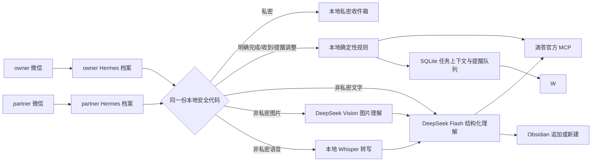

# 微信 AI 个人秘书

这是一个独立、仅在本项目目录内运行的 Windows 版微信个人秘书。Codex 负责搭建、测试和维护代码；正式运行时，明确的提醒和后续补充优先在本地处理，复杂的非私密消息才由 Hermes Agent 调用 DeepSeek API 理解，再按安全规则操作滴答清单和本地 Obsidian。

配置与历史验收：`owner` 与 `partner` 已分别完成微信扫码和滴答官方 MCP OAuth，共用同一份 DeepSeek API 配置。两人的独立 Vault/私密收件箱路径已配置，Inbox/Obsidian 最小映射已确认；两套档案曾完成专用 Inbox 测试任务的真实创建、完成及回读验收。日常任务、普通笔记、公开链接笔记和自动判断使用 `deepseek-v4-flash`；非私密图片使用 `deepseek-v4-flash-vision-exp`；明确的深度笔记使用 `deepseek-v4-pro`。结构化任务关闭深度思考以降低延迟和 Token。离线 Whisper `small` 模型沿用原配置。两套档案配置为正式写入模式，任务、提醒队列、Cron 和微信发送路由彼此隔离。固定的 08:00 今日重点、22:00 晚间复盘已按要求取消；用户指定的到点提醒不受影响。后台自恢复和当前用户登录自启保留，未安装 Windows 系统服务。历史验收不代表每次新代码都已上线；最新离线审核及部署边界见 [2026-08-30 审核记录](docs/audit-2026-08-30.md)。

## 设计概览



关键边界：

- `owner` 与 `partner` 是两个独立 Hermes 运行档案和前台进程，分别保存微信凭证、滴答 OAuth、Vault、私密收件箱、SQLite、提醒队列、Cron 和媒体缓存；不使用同一进程内的用户路由来假装隔离。
- 两套档案只共享程序代码。根目录 `.env` 即使存在，也只允许导入 DeepSeek 的两个字段，不允许微信凭证串入另一档案。
- 仅接收 `weixin` 私聊，并要求用户 ID 命中 allowlist；群聊在进入模型前被丢弃。
- `私密：` 和“私密：下一条”覆盖正文、图片、语音的完整处理链，绝不调用 DeepSeek、OCR 或 ASR。发送无文字说明的私密图片/语音时，应先单独发送“私密：下一条”。
- DeepSeek 只收到当前一条非私密消息、参考时间、已确认分类名及高相关双链候选；不发送 Vault 全文或滴答完整历史。
- 日常任务、普通笔记和自动判断使用 `deepseek-v4-flash`；非私密图片先由 `deepseek-v4-flash-vision-exp` 做一次结构化理解；明确的 `深度笔记：` 使用 `deepseek-v4-pro`。所有这些路由都设置 `reasoning_effort: none`。
- 图片在本地按文件真实内容校验为 JPEG、PNG、GIF 或 WebP，去除 EXIF、限制尺寸后以内联 Base64 发送；不使用 DeepSeek Files API 长期保存。每条消息最多处理 4 张、每张原文件最多 16 MiB。
- 非私密语音只在本机用 `faster-whisper` 的 `small` 模型转写，CPU `int8` 运行；原始音频和转写步骤都不发送给 DeepSeek。转写得到的最小必要文字再按任务/笔记规则分流。
- 链接笔记只读取一个公开 HTTP/HTTPS HTML 或纯文本页面，不使用 Cookie、不登录账号、不执行脚本；DNS、每次跳转和最终地址都必须通过地址安全检查，禁止本机、内网、非标准端口和 URL 内嵌凭证。本机代理使用的 RFC 2544 `198.18.0.0/15` fake-IP 只有在档案配置明确开启时才兼容，其他私网或保留地址仍全部拒绝。分享链接的完整查询串只在本机请求页面时短暂使用；进入 DeepSeek、笔记、预览和回复前会移除用户信息、片段、授权/会话参数及 `xsec_*`、`utm_*` 等跟踪参数，同时保留读取内容所需的普通参数。网页正文始终作为不可信资料，不能改变系统指令或调用工具。
- 滴答工具白名单只包含查询、`create_task` 和单任务 `complete_task`。批量完成、删除、移动和自动建分类均未开放。
- 滴答服务器仍标记为 `untrusted`。只有配置中逐个列明的只读工具免重复确认；`create_task` 需要本地映射、结构、真实模式和 `-ConfirmRealWrites`，`complete_task` 还要额外通过独立的 `-ConfirmTaskCompletion`。执行器本身会再次检查两个不同的进程授权变量，不依赖 MCP 的临时交互批准。
- Obsidian 只追加或新建，不覆盖原文；目标路径必须保持在指定 Vault 内。
- 日志只记录消息引用哈希、结果状态和错误类型，不记录消息正文、Key 或 Token。
- 秘书状态库固定使用 SQLite `DELETE` 回滚日志模式和 `EXTRA` 同步级别，避免旧运行库的 WAL-reset 风险；不升级或下载依赖。模式无法安全切换时拒绝初始化，不悄悄继续使用 WAL。首次应用该保护必须先停止对应旧网关，让旧连接全部关闭，不能在线删改数据库的 `-wal` / `-shm` 文件。

## 目录

```text
wechat-ai-secretary/
├─ .github/workflows/                  # 无秘密值的自动测试与凭证扫描
├─ .hermes/plugins/wechat-secretary/  # Hermes 项目级插件入口
├─ config/                             # 安全配置示例与本地 Dry Run 配置
├─ scripts/                            # 安装、授权、状态、备份、后台与 Cron
├─ src/wechat_secretary/               # 路由、执行器、网页安全读取、幂等与提醒
├─ tests/                              # 离线测试与 Dry Run 消息
└─ runtime/                            # 两套 Hermes、OAuth、SQLite、日志；整体被 Git 忽略
```

档案与数据位置：

| 档案 | Hermes/OAuth | 状态库 | Vault | 私密收件箱 |
|---|---|---|---|---|
| `owner` | `runtime/hermes-home` | `runtime/state/owner` | `D:\WeChatAIData\owner\Vault` | `D:\WeChatAIData\owner\PrivateInbox` |
| `partner` | `runtime/hermes-home-partner` | `runtime/state/partner` | `D:\WeChatAIData\partner\Vault` | `D:\WeChatAIData\partner\PrivateInbox` |

这些数据目录与程序目录分离不会影响运行。它们只是明确的读写目标；程序升级或重装项目依赖时不会把笔记混进代码目录。两套目录仍属于同一个 Windows 账号的文件权限范围，如需防止彼此在电脑上手动查看，还要另外使用不同 Windows 账号或文件权限。

## 消息规则

### 创建与查询

- `待办：` 强制解析为任务；只有标题、没有日期或时间也会直接进入 Inbox。若消息包含日期、提醒、分类或优先级但模型未能可靠解析，则明确要求补充，不会静默丢掉这些字段。
- `笔记：` 强制保存为笔记；标题、正文、摘要和标签必须忠实原意，并使用严谨、客观、专业的表述，不补充用户未提供的事实、推测或评价；双链只能来自已存在候选，最多 3 个。
- `深度笔记：` 与普通笔记遵循相同的客观、专业表述和写入边界，但使用 Pro 做更细致的摘要、标签和双链判断。带图片时先由视觉模型提取事实，再把事实文本交给 Pro；原图不会再次发送。
- 不要求固定前缀：`明天下午3点提醒我回电话`、`记得周五提交报告`会路由为任务；`帮我记一下……`、`整理成笔记……`会路由为笔记。创建或记录必须先由本地规则识别到明确意图，模型只能提取结构、不能单独授权写入；普通陈述、提醒状态和“为什么会提醒/你会提醒吗”等询问不会写入，无法确定时只追问。
- 提醒事项中的“查一下有哪些”“问导师交了吗”“取消会议提醒”等是将来要做的内容，不作为此刻的查询或取消命令。中文钟点与数字钟点等价；“四点多”仍会追问准确钟点，但不会丢掉已经提供的日期和事项。补充“买牛奶”“下午三点”“不是今天，是明天”时，沿用当前会话中尚未完成的提醒草稿，不要求重说整句。
- 时间后面的逗号、句号、分号、顿号或换行不改变提醒意图；末尾独立补充“下午四点半”会与前面的钟点合并，而不混进任务标题。日期省略时，只有明确且今天尚未过去的时刻才默认今天；裸说“四点半”会询问上午还是下午，不擅自解释为凌晨。真正冲突或过去的时间仍需澄清，不自动改到明天。
- 微信入口保持同一发送者的媒体下载顺序、同一会话的处理顺序；不把连续文字自动合并，也不按内容误删新消息 ID 的相同回复。原消息 ID 的去重仍保留。引用中的指令不能授权操作，原生引用消息中用户自己的私密前缀仍优先保护。
- 语音转写会保守修正常见表达，例如有任务或时间信号时把句首“代办”理解为“待办”，并把 `B2，M` 还原为 `B2M`；文字中的“代办营业执照需要什么资料”不会因此误建任务。
- 混合消息的 `task_create`、`note_write`、`reminder_create` 分别记账。部分失败时，相同微信消息 ID 的安全重试只重跑明确失败的步骤；已成功步骤不会重复。
- 微信回复使用热情、温柔、大方且简洁的本地固定话术，不使用夸张语气或额外寒暄，也不增加模型调用。正式模式静默等待核验，只发送一次最终结果；同一条消息同时创建任务和设置提醒时合并成一句自然短句，例如“✅ 已设置好，2026-08-26 09:00 准时提醒你看细胞状态。”，不再附加清单名、提醒详情、执行说明或内部诊断。笔记成功时在同一个气泡中附上经过长度限制的摘要、标签和关联，让用户知道实际保存了什么。私密内容仍不回显。失败或需要澄清时温和、明确地说明原因。单次结果在 2000 字符内保留为一个带换行的气泡；只有超长内容才拆分。
- Dry Run 以“Dry Run｜已为你整理好模拟结果”开头，只显示人类可读结果，不显示 JSON、工具参数或内部 ID，也不使用“已创建”冒充真实成功。

### 公开链接笔记

- `帮我记一下这个链接：https://...`、`整理一下 https://...`：读取公开网页后使用 Flash 保存普通笔记。
- `深度笔记：https://...`、`深入分析这个链接：https://...`、`详细研究 https://...`：读取后使用 Pro 保存深度笔记。只有明确出现这些深度表达才升级模型。
- 只发送网址时不会立刻联网；系统会要求把选择和链接放在同一条消息中重发。一次只整理一个链接。
- 笔记正文固定附上网页标题、最终来源网址和读取时间；网页无法读取、模型结果不可靠或写入失败时明确回复原因，不冒充成功。
- `私密：https://...` 只按私密内容在本地保存原消息，绝不联网打开该网址。
- 可以发送 `帮助` 或 `秘书状态` 获取本地固定说明，不调用模型、不增加 API Token。

### 完成任务

- 只有独立的“已完成”“做完了”“搞定了”，或“完成：任务名”可触发单任务完成。
- “收到”“好的”“知道了”“开始做”“没做完”只记录已确认，不改变滴答状态。
- 最近提醒、创建或查询结果会在本地保存 task ID 和会话上下文。只有唯一候选才调用 `complete_task`。
- 多个候选时列出编号，需在 5 分钟内回复“完成 1”；上下文过期时要求重新指定任务名。
- `complete_task` 后必须用 `get_task_by_id` 回读为已完成状态，才回复“已为你完成任务：…｜清单”。网络中断或回读不明确时标为“结果还需要确认”，不会自动重试。
- “全部完成”“这些都完成”等批量表达固定拒绝；`complete_tasks_in_project` 未加入白名单。

### 截止时间与微信提醒

- `due_date` / `due_time` 是滴答任务截止或安排时间；`reminder_at` 是本地微信提醒时间，两者独立。
- 只有明确出现“提醒我”等意图时才建立微信提醒。仅有截止时间时不自动推导提醒或提前量。
- 独立回复“半小时后提醒”只重排最近唯一任务的本地微信提醒，不修改滴答截止时间。
- 对未进入最近上下文的既有任务，可发送 `补设提醒：2026-08-25 14:00｜任务名`。系统只会精确查询并回读唯一未完成任务，再写入当前档案的本地提醒队列；不会新建或完成滴答任务。
- 本地提醒以 `(task_id, reminder_at)` 去重。断网或休眠后会补发；超过 2 小时的多条过期提醒每 10 项分组，每项实际展示后才标记送达，不再隐藏第 11 项之后的事项。只有能够证明消息尚未提交发送时才自动重试；发送超时、连接中断或结果不明会标记为待人工确认并停止自动重试，避免重复提醒。
- 微信发送调用前若能确认通道尚未就绪，提醒会按退避时间安全重试；一旦发送调用已经提交，超时、连接中断、适配器失败结果或进程中断都记为 `uncertain` 并停止自动重试，避免同一提醒被重复投递。
- 设置成功和到点提醒都使用自然短句，不附带内部清单名、执行步骤、脚本路径或工具错误；内部诊断只写入本地去敏日志。
- “收到”不会取消提醒。有限重复提醒支持“每周二上午9点，共3次”这类规则，限制为每周一次、共 2 到 52 次；缺少星期、具体时间或总次数时只追问缺失字段。每天、每月、无限循环及系列局部改期仍会明确拒绝，不会猜测。
- 最近唯一提醒可用“改成明天下午四点”调整；“取消刚才那个提醒”只取消本地提醒，不完成或删除滴答任务。取消重复提醒时会区分“本次”和“整个系列”；已提交微信发送的消息无法承诺撤回，发送结果不明时停止自动操作。
- “再提醒三次”表示额外追加三次，不会新建同名任务；间隔不明时只追问间隔，例如补充“每隔二十分钟”。这是有上限的追加，不是无限循环。每周多个星期、系列改期和一句话中的多个独立定时提醒暂不自动拆解，明确要求分开处理，避免少建或错排。
- “查笔记”暂不支持检索，会明确说明，不会误查滴答任务。草稿和最近任务引用按会话隔离，并检查过期、消息先后和任务完成状态，避免误操作旧任务。
- 提醒调度默认关闭。启用后，它在 Hermes 前台网关的 Weixin 适配器启动就绪或离线重连成功时立即绑定发送通道并扫描到期队列，不再依赖用户先发一条私聊；首条私聊绑定仍保留为旧运行时兼容兜底。

## 首次安装

项目锁定官方 Hermes Agent `v2026.8.19`，安装位置只在本目录的 `.venv` 和 `runtime/hermes-agent`。媒体扩展也只安装到项目 `.venv`；Whisper 权重只缓存在 `runtime/models`，两套档案可共用模型权重，但消息、媒体、OAuth、Vault 和状态仍完全分开。安装脚本会幂等应用四个项目内补丁：`hermes-dida-oauth-issuer.patch` 只兼容滴答公开 OAuth 元数据在根路径末尾斜杠上的不一致，且必须由 `issuer_trailing_slash_compat_host: dida365.com` 显式启用；`hermes-exact-tool-approval.patch` 只允许本地配置中逐个列出的已发现工具跳过重复确认，写工具还要求当前前台启动进程具有显式确认标记；`hermes-weixin-compact-multiline.patch` 让不超过微信适配器 2000 字符上限的多行回复保持为一个气泡，只有超长内容或显式旧版逐行模式才拆分；`hermes-gateway-ready-hook.patch` 在消息适配器启动就绪及离线重连成功后向项目插件发出 best-effort 生命周期通知，使提醒调度无需等待首条私聊。前两个安全补丁不会把滴答服务器整体改为完全信任。安装不会修改系统 PATH、安装 Windows 服务或设置开机自启。

此外安装脚本会应用 `hermes-weixin-secretary-ingress.patch`：仅本项目入口启用时，串行处理同一发送者的媒体下载，禁用文字自动合批与内容指纹去重；普通 Hermes 启动不受影响。项目入口会核验补丁标记，缺补丁时拒绝启动，避免悄悄使用旧消息链路。升级本轮代码不需要重新下载语音模型。

```powershell
Set-Location D:\Codex\workspaces\my-tools\wechat-ai-secretary
.\scripts\install-local.ps1
```

安装后先为两套隔离档案写入本地语音参数，再运行离线测试：

```powershell
# 分别为两个隔离档案启用本地中文语音转写
.\scripts\configure-media.ps1 -Profile owner
.\scripts\configure-media.ps1 -Profile partner
.\scripts\dry-run.ps1
$env:PYTHONPATH = "src"
python -m unittest discover -s tests -v
```

第一次准备语音功能时会把约 486 MB 的 Whisper `small` 模型下载到项目 `runtime/models`。这是两套档案唯一共享的媒体资源；模型权重不含消息内容。Windows 不支持缓存软链接时可能略多占磁盘，但不需要管理员权限。

## 模型与上下文成本

- 明确的单项提醒（含有限每周提醒）、缺项补充、最近提醒改期/取消/追加和重复消息由本地规则处理，不调用 DeepSeek；同样经过完整的意图、时间、权限和幂等校验。语音转写结果也走这一条路径，本轮不更换或下载语音模型。
- 包含图片、链接、分类、截止时间或多个事项等复杂输入保留模型处理，不以省 Token 为由丢字段或猜测时间。带多个独立提醒的消息会要求分开处理，不能合并为只提醒一次的任务。
- 本地已确定任务、笔记或查询意图后，分别使用紧凑任务、笔记或只读查询结构，无需固定前缀；无法分流时才使用完整结构。任务/查询不扫描或发送笔记双链候选，查询不携带任务写入结构；提示词仅包含当前类型所需规则。
- 每次调用只带当前消息，不继承 Hermes 主会话历史；澄清草稿保存在本地。保留既有输出长度上限，避免截断结构化结果；离线回归同时断言模型调用次数及实际事项、时间和队列结果。零调用场景不消耗理解模型 Token，整体账单降幅仍取决于真实消息构成，不能用提示词字符数冒充 Token 实测值。
- 模型底层客户端可能对瞬态网络故障重试；应用层“调用一次”不等同于账单恰好一次请求。本轮未提高模型输出上限、增加历史上下文或额外调用模型复核结果。
- 普通图片由 Vision 一次完成看图与结构化判断。DeepSeek 官方当前规则下，每张图片视觉输入最高约 384 token；本项目再限制为每条最多 4 张。
- 普通笔记仍使用 Flash；只有明确 `深度笔记：` 才使用 Pro。带图深度笔记需要 Vision + Pro 两次调用，但原图只发送给 Vision 一次。
- 语音模型在本地运行；只有非私密语音的转写文字会按最小必要原则进入 Flash/Pro。私密语音不做本地转写，也不进入 DeepSeek。
- 链接读取本身不使用模型 Token；提取后的正文最多保留 18000 字符，再由 Flash 或 Pro 整理。普通链接使用 Flash，只有明确深度表达才使用 Pro。

## 本机授权：不要把凭证发到聊天

所有 Key、Token 和扫码都由你在本机终端完成。`-Profile` 决定写入哪一套独立凭证目录。不要在同一次向导中混用两个人的账号。

```powershell
# 两套均已完成；以下命令仅用于将来重配
.\scripts\setup-auth.ps1 -Profile owner -ConfigureModel
.\scripts\setup-auth.ps1 -Profile owner -ConfigureWeixin

# partner 使用同一份 DeepSeek Key，并由 partner 扫自己的微信二维码
.\scripts\setup-auth.ps1 -Profile partner -ConfigureModel
.\scripts\setup-auth.ps1 -Profile partner -ConfigureWeixin

# 两个人分别登录自己的滴答账号做官方 MCP OAuth
.\scripts\setup-auth.ps1 -Profile owner -AuthorizeDida
.\scripts\setup-auth.ps1 -Profile partner -AuthorizeDida
```

Hermes 分别把凭证放在 `runtime/hermes-home` 与 `runtime/hermes-home-partner`，两者都被 `.gitignore` 排除。根目录 `.env.example` 仅保留可选的 DeepSeek 共用字段；微信凭证和 allowlist 只能由各档案的 Hermes 向导保存。

## 先读结构，再确认映射

### 滴答清单

OAuth 完成后，分别运行只读检查。它只开放 `secretary_dida_taxonomy`，读取该账号现有清单、文件夹和标签，不创建新分类。

```powershell
.\scripts\inspect-dida.ps1 -Profile owner
.\scripts\inspect-dida.ps1 -Profile partner
```

当前只读结果：`owner` 有 `Inbox` 和滴答自带的 `👋欢迎`，`partner` 只有 `Inbox`；两者均没有清单文件夹或标签。`👋欢迎` 只是新账号引导清单，不参与业务映射。

官方 MCP 已公布可解析的工具结构，可随时用下列命令重新核对；它只做工具发现，不调用任何任务工具：

```powershell
.\scripts\inspect-dida-schema.ps1 -Profile owner
```

2026-08-25 已用 owner 档案实时执行只读工具发现，并由本地结构校验器确认：`create_task` 使用外层 `task` 对象，日期使用 `dueDate`、`timeZone`、`isAllDay`，优先级为 `0/1/3/5`；`complete_task` 必须同时提供 `project_id` 与 `task_id`，`get_task_by_id` 只需要 `task_id`，`search_task` 使用 `query`。该命令现在会拒绝空结构或缺少必填字段的定义。

当前已确认两套档案都使用现有 Inbox，不映射 `👋欢迎`，也不创建分类或标签；两个本地配置的 `dida.mapping_confirmed` 已设为 `true`，`category_map` / `tag_map` 保持为空。owner 与 partner 均已分别用同一条专用任务依次完成真实创建、完成及精确回读，两套配置的 `schema_confirmed` 和 `complete_schema_confirmed` 均已设为 `true`。创建与完成后的回读都要求任务 ID、标题和清单精确对应；Hermes 同时返回文字与结构化结果时只使用结构化内容做机器核验；远端写入失败不会自动重试。

### Obsidian

两个空 Vault 已按推荐路径创建。先在 Obsidian 的 Vault 管理界面分别选择“打开文件夹作为仓库”：

- `D:\WeChatAIData\owner\Vault`
- `D:\WeChatAIData\partner\Vault`

`PrivateInbox` 不要作为 Vault 打开。程序只检查配置中指定的目录，不扫描磁盘。只读检查命令：

```powershell
.\scripts\inspect-vault.ps1 -Profile owner
.\scripts\inspect-vault.ps1 -Profile partner
```

目前两个 Vault 为空，最小映射已确认：都使用 `Inbox/微信收件箱.md`，不预创建大量目录或空白双链；两个本地配置的 `obsidian.mapping_confirmed` 已设为 `true`。后续已有真实目录和笔记时再扩充 `folder_map`、`known_links`。

## 启动、停止与状态

状态检查不会显示秘密值：

```powershell
.\scripts\status.ps1 -Profile owner
.\scripts\status.ps1 -Profile partner
.\scripts\doctor.ps1 -Profile owner -Strict
.\scripts\doctor.ps1 -Profile partner -Strict
```

微信自动回复未确认前不要运行启动命令。确认后，用两个 PowerShell 窗口分别启动；第一轮仍只做微信端 Dry Run：

```powershell
.\scripts\start.ps1 -Profile owner -ConfirmWechatReplies
.\scripts\start.ps1 -Profile partner -ConfirmWechatReplies
```

每套档案都是独立前台进程，所在窗口按 `Ctrl+C` 停止。真实写入需要对应配置中 `dry_run = false`，同时再加显式参数：

```powershell
.\scripts\start.ps1 -Profile owner -ConfirmWechatReplies -ConfirmRealWrites
.\scripts\start.ps1 -Profile partner -ConfirmWechatReplies -ConfirmRealWrites
```

允许创建任务不会顺带允许完成已有任务。完成操作还需结构实测确认，并在本次前台启动时额外加入：

```powershell
.\scripts\start.ps1 -Profile owner -ConfirmWechatReplies -ConfirmRealWrites -ConfirmTaskCompletion
.\scripts\start.ps1 -Profile partner -ConfirmWechatReplies -ConfirmRealWrites -ConfirmTaskCompletion
```

本地逐任务提醒按档案独立授权，还需要该档案的 `reminders.enabled = true` 和第三个显式参数。当前两套档案都已分别授权：

```powershell
.\scripts\start.ps1 -Profile owner -ConfirmWechatReplies -ConfirmRealWrites -ConfirmReminders
.\scripts\start.ps1 -Profile partner -ConfirmWechatReplies -ConfirmRealWrites -ConfirmReminders
```

`owner` 与 `partner` 使用独立 SQLite 队列和独立微信发送路由；任何一方的任务都不会进入另一方的提醒队列。

不在前台窗口时，可先预览停止行为；真正发送停止命令必须确认：

```powershell
.\scripts\stop.ps1 -Profile owner
.\scripts\stop.ps1 -Profile owner -ConfirmStop
.\scripts\stop.ps1 -Profile partner -ConfirmStop
```

当前后台常驻通过当前 Windows 用户的计划任务实现，不安装系统服务。主入口和每分钟健康检查都经 `wscript.exe` 无控制台窗口启动，PowerShell 与网关不会弹出黑框。两套档案已分别启用；可随时核对状态：

```powershell
.\scripts\status-autostart.ps1 -Profile owner
.\scripts\status-autostart.ps1 -Profile partner
```

需要重新安装并立即启动时，按档案单独执行：

```powershell
.\scripts\configure-autostart.ps1 -Profile owner -Apply -StartNow
.\scripts\configure-autostart.ps1 -Profile partner -Apply -StartNow
```

后台入口会为对应档案保留已经单独确认的微信回复、真实写入、任务完成和本地提醒权限。每个网关进程的系统命令行还带有经过校验的精确档案路径标记，因此 Hermes 的进程识别、停止和恢复不会把另一人的自定义档案当成当前档案。`owner` 与 `partner` 始终使用各自独立的进程、状态库和发送路由。

一次性后台引导器只记录固定的启动、退出、异常类型和停用事件；健康检查只记录健康、降级和恢复状态，不记录微信正文、网页正文、ID、网址或凭证，日志位于 `runtime/logs/<profile>`。每分钟检查会核对当前档案状态文件中的精确 PID、Hermes Home、运行状态和微信连接：进程消失时立即静默恢复；仅微信连接异常时需连续 5 次确认后才重启，避免短暂网络波动造成抖动。停止或重装只操作状态文件中启动时间也匹配的唯一进程，不做跨档案全局扫描。执行 `stop.ps1 -ConfirmStop` 会写入当前档案的停用标记，因此不会被健康检查重新拉起；重新执行 `configure-autostart.ps1 -Apply -StartNow` 才恢复后台。

## 项目内加密备份

备份工具只处理当前项目内对应档案的本地配置、SQLite 一致性快照和 Hermes 授权状态，不读取项目外的 Vault，也不生成明文临时压缩包。输出由 Windows DPAPI 按当前 Windows 用户加密，两套档案分别保存，默认保留最近 7 份：

```powershell
# 预览
.\scripts\backup-profile.ps1 -Profile owner
.\scripts\backup-profile.ps1 -Profile partner

# 明确创建
.\scripts\backup-profile.ps1 -Profile owner -Apply
.\scripts\backup-profile.ps1 -Profile partner -Apply

# 验证指定加密包，只在内存中解密检查，不解压、不显示内容
.\scripts\backup-profile.ps1 -Profile owner -VerifyArchive "runtime\backups\owner\owner-时间.wasbak"
```

DPAPI 备份只能由相应的 Windows 用户环境解密。Vault 位于项目外，仍应使用你单独确认的加密备份方案；本工具不会越界读取或复制。

## 08:00 与 22:00 Cron（当前已关闭）

两套档案的 08:00 今日重点和 22:00 晚间复盘均已按要求取消，普通升级和重启不会恢复。以下命令仅供用户将来明确要求重新启用时使用，不属于状态检查或日常维护；会从对应档案的本地状态读取已验证路由，路由值不会回显：

```powershell
.\scripts\configure-cron.ps1 -Profile owner -UseStoredWeixinRoute -Apply
.\scripts\configure-cron.ps1 -Profile partner -UseStoredWeixinRoute -Apply
```

重新启用后，每套档案只维护自己的两项 Cron，时区固定为 `Asia/Shanghai`；重复运行不会创建同名任务。微信只接收实际提醒正文并保留原有语气，不显示 `Cronjob Response`、Cron 名称、`job_id`、英文管理提示或内部清单名。逐任务到点提醒不依赖这两项 Cron，而使用各自的本地 SQLite 队列。

## 故障恢复

- 如果滴答 OAuth 报 `metadata issuer mismatch` 且错误两端只差末尾 `/`，先确认两个 Hermes 配置都保留 `issuer_trailing_slash_compat_host: dida365.com`，再重新运行对应档案的 `-AuthorizeDida`。其他主机、协议或路径不一致仍应停止，不要扩大兼容范围。
- 外部写调用中断时不要立即重发原消息；先在滴答或 Vault 核对。状态为 `uncertain` 的操作不会自动重试。
- 可用 `backup-profile.ps1` 分别创建并验证项目内 DPAPI 加密备份；不要把解密后的授权状态复制给另一位用户。
- SQLite 保存操作结果、task ID、任务标题、微信路由、提醒时间和状态，但不保存完整普通入站消息正文。为衔接“几点/哪天”等补充回复，会临时保存最小化任务草稿（标题、日期、时间和有限重复规则），默认 10 分钟过期并全局清理；描述、分类、标签等自由文本不进入该草稿，结果不确定时会立即抹除草稿内容。私密正文只存在你指定的私密收件箱。
- 如果 SQLite 损坏，先停止网关并复制原文件留证，不要删除或重建；依据滴答和 Vault 现状人工恢复，避免重复副作用。
- OAuth 失效时，用正确的 `-Profile owner` 或 `-Profile partner` 重新运行 `scripts/setup-auth.ps1 -AuthorizeDida`，成功后只重启对应网关。

## 当前限制

- 图片、语音、私密链路、真实滴答写入、Obsidian 写入、任务完成和两端独立提醒均已完成验收。
- GIF 只分析第一帧；视觉结果不能保证精确识别极小文字，关键日期、金额或任务对象不明确时会要求确认。语音环境噪声较大或转写置信度不足时同样不会猜测执行。
- “私密：”如果只在语音里说出，系统必须先做本地 ASR 才能知道该前缀，因此会拒绝继续处理；要保证连本地 ASR 都不运行，请在发送媒体前先发“私密：下一条”。
- 链接笔记只支持公开 HTML、XHTML 和纯文本页面；登录页、付费墙、需要 Cookie 的页面、PDF、文件下载及大多数强依赖 JavaScript 的页面会明确拒绝或提示改发截图。
- 实际创建和完成仍保留结构验证、精确回读、幂等及失败不冒充成功等安全闸门。
- Windows 无窗口后台常驻、每分钟真实健康检查和当前用户登录自启已通过两套独立计划任务启用；未安装 Windows 系统服务，未登录该用户前不会运行。计划内维护重启会静默省略无实际任务被中断时的 Gateway 停机广播；若确有正在处理的消息，仍保留必要的中断提示。

## 自动检查

GitHub 私有仓库每次推送或发起拉取请求时，使用 Windows runner 安装锁定的 Hermes 版本，执行仓库凭证扫描、全部 PowerShell 语法检查、Python 编译、165 项离线测试以及仅使用合成数据的 DPAPI 备份自检。工作流权限仅为读取仓库内容，不持久化检出凭证，也不使用项目 API Key。

## 官方资料

- [Hermes Agent 官方仓库](https://github.com/NousResearch/hermes-agent)
- [Hermes Gateway CLI](https://hermes-agent.nousresearch.com/docs/reference/cli-commands/)
- [Hermes 插件与 Gateway Hook](https://hermes-agent.nousresearch.com/docs/user-guide/features/hooks/)
- [Hermes Cron](https://hermes-agent.nousresearch.com/docs/user-guide/features/cron/)
- [DeepSeek API 文档](https://api-docs.deepseek.com/)
- [DeepSeek 图像理解与 Token 限制](https://api-docs.deepseek.com/zh-cn/guides/vision/)
- [滴答清单官方 MCP](https://help.dida365.com/articles/7438132116019216384)
